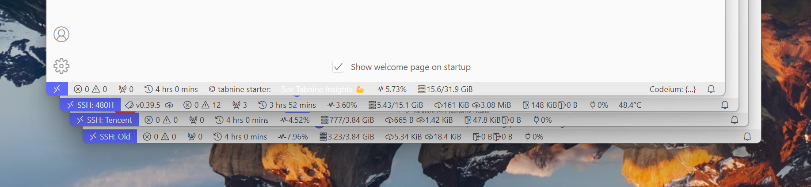
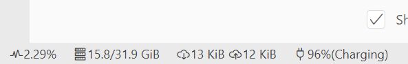
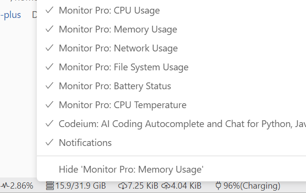

# Monitor Pro

[English](./README.md) | 简体中文

Monitor Pro is a comprehensive resource monitoring tool designed to help you keep track of important system metrics in real-time. Whether you're a developer, system administrator, or simply someone who wants to stay informed about their computer's performance, this extension has you covered.

## Screenshots

## Features

- [ ] **Resources Monitor**
  - [x] **CPU Usage**: Monitor the percentage of CPU utilization to understand how much processing power is being utilized by your system.
  - [x] **CPU Frequency**: Keep track of the current CPU frequency to understand how your system is dynamically adjusting its processing power.
  - [x] **CPU Temperature**: Monitor the temperature if it can.
  - [x] **Memory Usage**: Keep an eye on the memory consumption of your computer.
  - [x] **Network Usage**: Track the network activity on your machine, including incoming and outgoing data transfer rates.
  - [x] **File-system Usage** (Linux, macOS): Provides the read/write rate of the disk
  - [x] **Battery Percentage and Charging Status**: If you're using a laptop or a portable device, this feature allows you to monitor the battery level and charging status.
  - [x] **OS Distro**
  - [ ] **Disk Usage**
- [x] **Order**: Customize the order in which the monitored resources are displayed to you, making it convenient to monitor them at a glance.
- [x] **Refresh Interval**: Set the refresh interval for updating the resource metrics.
- [x] **No Layout Shift**: Ensures that the position and size of elements in the StatusBar do not unexpectedly change.
- [x] **Remote SSH Resources Monitor**: You can keep track of important system metrics on a remote SSH-connected device.
- [ ] **High Occupancy Alert**: Receive alerts when any of the monitored resources reach a high occupancy level.
- [ ] **Dashboard**: I want to display information all you care about in a page with abundant charts.

## Inspired by

- <https://github.com/chneau/vscode-resource-monitor>
- <https://github.com/Njanderson/resmon>

## Support Me

Please give a star on [Github](https://github.com/nexmoe/vscode-monitor-pro) or leave a five-star review on [VS Code Marketplace](https://marketplace.visualstudio.com/items?itemName=nexmoe.monitor-pro&ssr=false#review-details)!
